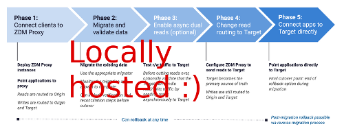

<!-- TOP -->
<div class="top">
  
  <div class="scenario-title-section">
    <span class="scenario-title">Multi Terminal Scenario</span>
    <span class="scenario-subtitle">ℹ️ For technical support, please contact us via <a href="mailto:aleksandr.volochnev@datastax.com">email</a> or <a href="https://dtsx.io/aleks">LinkedIn</a>.</span>
  </div>
</div>

<!-- NAVIGATION -->
<div id="navigation-top" class="navigation-top">
 <a href='command:katapod.loadPage?[{"step":"step1-astra"}]'
   class="btn btn-dark navigation-top-left">⬅️ Back
 </a>
<span class="step-count"> Step 2 of 2</span>
 <a href='command:katapod.loadPage?[{"step":"finish"}]' 
    class="btn btn-dark navigation-top-right">End ➡️
  </a>
</div>

<!-- CONTENT -->

<div class="step-title">This is it</div>

✅ Observe that, upon loading of this step, a command is triggered on the second terminal.
**But only the first time you get here**.

✅ Ready for a two-line non-executable code block?
```
### {"execute": false}
echo \
  "wow"
```

✅ This code block will *automatically* issue a Ctrl-C, followed by more stuff:
```
### {"terminalId": "term_3", "macrosBefore": ["ctrl_c"]}
# (a Ctrl-C to stop the running process, then:)
find -name "*.md"
```

# Markdown Title

This part tests the rendering of markdown section hierarchy

## Markdown Section

This is a section.

### A subsection

And here is a subsection

#### A sub-sub-section

The above had _four_ pound symbols **in a row**, wow.

##### Does a five-pound piece ...

... without the Queen on it even exist?

###### What about:

six pound symbols?

# A collapsible-block test

This is the main text.

<details><summary>Show me also a list</summary>

1. Gluon
2. Photon
3. W boson
4. Z boson

</details>

# Images on the page, a test

### A local image (twice):

_In this case, some parsing is in order by the extension:_




### An external image:


# Links

Try this: [click here!](https://docs.datastax.com/en/astra-serverless/docs/migrate/introduction.html)

<!-- NAVIGATION -->
<div id="navigation-bottom" class="navigation-bottom">
 <a href='command:katapod.loadPage?[{"step":"step1-astra"}]'
   class="btn btn-dark navigation-bottom-left">⬅️ Back
 </a>
 <a href='command:katapod.loadPage?[{"step":"finish"}]'
    class="btn btn-dark navigation-bottom-right">End ➡️
  </a>
</div>
